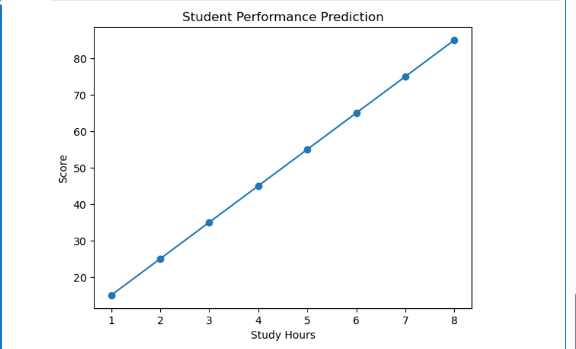

# Student Performance Predictor

## Overview
This Machine Learning project predicts student scores based on the number of study hours using Linear Regression.

## Technologies Used
- Python
- Pandas
- Matplotlib
- Scikit-Learn

## Features
- Data Visualization
- Linear Regression Model
- Score Prediction
- Graphical Analysis

## Example Prediction
If a student studies for 10 hours, the model predicts a score of approximately 105.

## Project Structure

- Student_Performance_Predictor.ipynb
- graph.png
- README.md

## Libraries Used
- pandas
- matplotlib
- scikit-learn

## Results
The model successfully learned the relationship between study hours and student scores and predicted future scores using Linear Regression.

## Model Equation
Score = 10 × Hours + 5

## Output Graph

